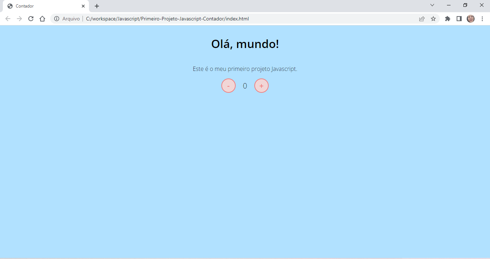
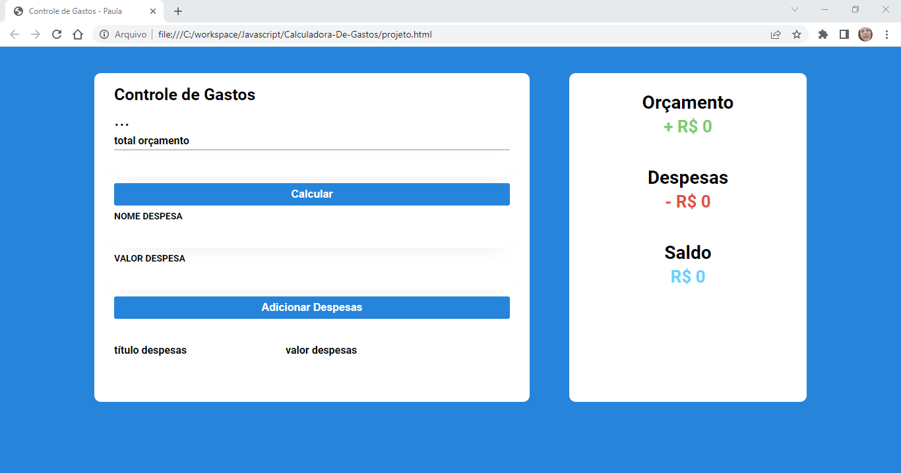
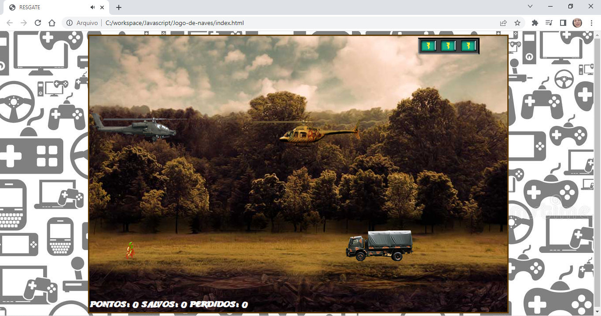
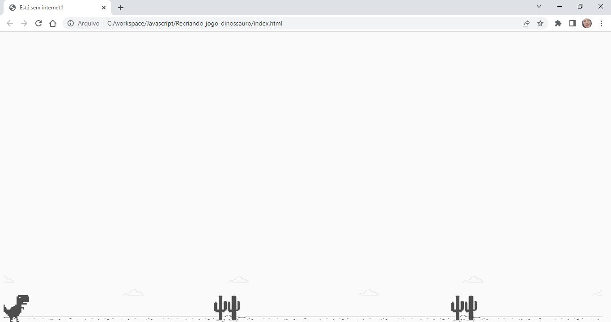
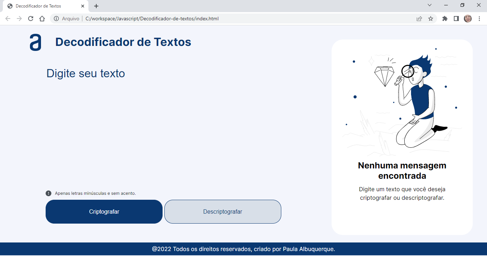

<h1 align="center">
    PROJETOS JAVASCRIPT
</h1>

<a href="#contador"> contador </a> <a href="#calculadora-de-gastos"> calculadora de gastos </a> <a href="interface-youtube"> recriando interface youtube </a> <a href="jogo-de-naves"> jogo de naves </a>  <a href="jogo do dinossauro">jogo do dinossauro</a> <a href="decodificador"> decodificador de texto </a>

<h2 id="contador">
    Primeiro Projeto Javascript - Contador
</h2>

## Layout

## :rocket: Sobre esse projeto

    Esse projeto foi criado no bootcamp da DIO  <strong> MRV FULLSTACK DEVELOPER </strong> na introdução a linguagem Javascript, o layout já peguei pronto para focar apenas na sintaxe Javascript. É um contador que vai de 0 a 100 ao clicar nos botões.

## :computer: Conceitos Aprendidos

- Pegar elementos do HTML (document.getElementById)
- Mudar elementos no HTML (innerHTML)
- Introdução a funções (Function)
- Condicionais (if/else)

<h2 id="#calculadora-de-gastos">
    Calculadora de Gastos - Maratona Kenzie
</h2>

## Layout

## :rocket: Sobre esse projeto

    Esse projeto foi criado na maratona realizada pela Kenzie Academy com a finalidade de criar um site completo utilizando apenas HTML, CSS e Javascript. O intuito é criar uma aplicação web para fazer o controle de gastos.

## :computer: Conceitos Aprendidos

- Pegar elementos do HTML (document.queryselector)
- Mudar elementos no HTML (innerText)
- Pegar valores de uma textArea (.value)
- Acionar um botão com AddEventListener
- criar um elemento HTML com document.createElement

<h2 id="interface-youtube">
    Recriando a Interface do Youtube - Maratona Kenzie Academy
</h2>

## Layout

## :rocket: Sobre esse projeto

    Esse projeto foi criado na maratona realizada pela Kenzie Academy com a finalidade de criar um site completo utilizando apenas HTML, CSS e Javascript. O intuito é recriar a interface do Youtube.

## :computer: Conceitos Aprendidos

- Conceito de lista (arrays)
- AppendChild
- Remover (.remove)
- Estruturas de repetição
- Elemento .closest

<h2 id="jogo-de-naves">
    Jogo de Naves - Modo florestas
</h2>

## Layout

## :rocket: Sobre esse projeto

    Esse projeto foi criado no bootcamp da DIO  <strong> MRV FULLSTACK DEVELOPER </strong> em um projeto para praticar os conceitos aprendido de HTML, CSS e Javascript. O intuito é criar um jogo completo onde o helicóptero precisar destruir os outros helicópteros, salvar as pessoas e destruir os caminhões.

## :computer: Conceitos Aprendidos

- Foi utilizado Jquery para facilitar a escrita dos códigos
- Utilizar os teclados (keydown e keyup)
- setInterval
- Math.random()
- Mudar css com jquery

<h2 id="jogo-dino">
    Recriando o jogo de dinossauro
</h2>

## Layout

## :rocket: Sobre esse projeto

    Esse projeto foi criado no bootcamp da DIO  <strong> PHILIPS FULLSTACK DEVELOPER | You Are You </strong> na introdução a linguagem Javascript, apesar de já ter concluído o curso, é interessante aplicar os conceitos aprendido em projetos novos e dessa vez foi o famoso jogo do dinossauro que aparece quando estamos sem internet.

## :computer: Conceitos Aprendidos

- Fazer animações com CSS e Javascript:
    setInterval
    @frames
- Conceitos de position absolute

<h2 id="decodificador">
    Decodificador de Texto
</h2>

## Layout

## :rocket: Sobre esse projeto

    Esse projeto é o sprint de abril do curso da <strong> ALURA + ORACLE </strong> para o treinamento do pensamento lógico e a criação de um design a partir do figma. O intuito é desenvolver a capacidade de interpretação ao se receber o layout e conseguir aplicar os conceitos aprendidos.

## :computer: Conceitos Aprendidos

- Trabalhar a responsabilidade do site (versões para tables e celulares)
- Mudar elementos no HTML (innerHTML)
- Posicionar as divs com o elemento flex
- Autonomia para criar a lógica

